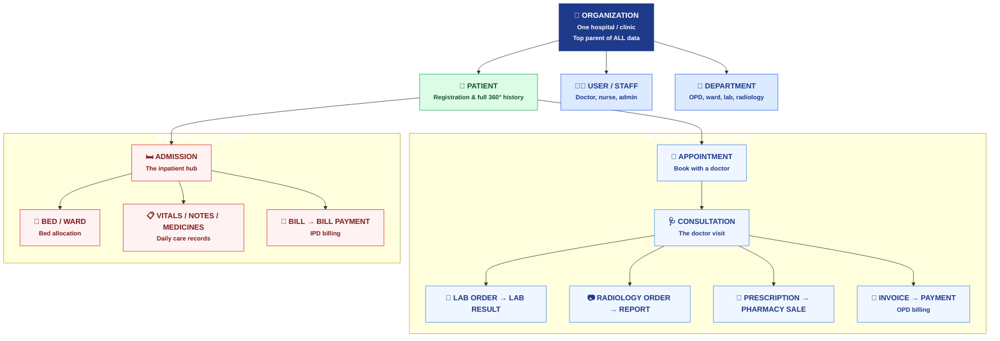
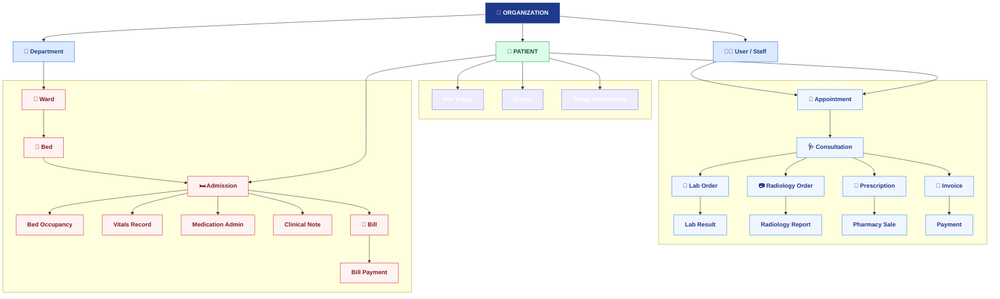

# Hospital Management System — Clean Client Diagram

> **How to turn this into an image for your client:**
> 1. Copy the code block below (everything between the ```` ```mermaid ```` lines).
> 2. Go to **https://mermaid.live**
> 3. Paste it on the left → a clean diagram appears on the right.
> 4. Click **Actions → PNG / SVG** to download a high-quality image to show the client.
>
> Because this uses **automatic layout**, the boxes will **never overlap** like the old image did.

---

## Diagram 1 — The Big Picture (recommended for the client)



**One-line story to tell the client:**
> "Everything belongs to the **Organization**. Every patient has a single record. From there a patient flows **one of two ways** — Outpatient (blue: appointment → doctor → tests → bill) or Inpatient (red: admission → bed → daily care → bill). Clean and simple."

---

## Diagram 2 — Detailed Version (for technical reviewers)



---

## Why this is better than the old image

| Old image problem | Fixed here |
|---|---|
| Boxes overlapped (ADMISSION on DEPARTMENT, PHARMACY on records) | Auto-layout = **boxes never overlap** |
| Arrows crossed messily | Organized **top-to-bottom in lanes** |
| Hard to tell OPD from IPD | **Color-coded**: blue = OPD, red = IPD, green = patient |
| Looked cluttered | Clean, professional, presentation-ready |

> Tip: For the client meeting, use **Diagram 1** (big picture). Keep **Diagram 2** ready only if a technical person asks for detail.
