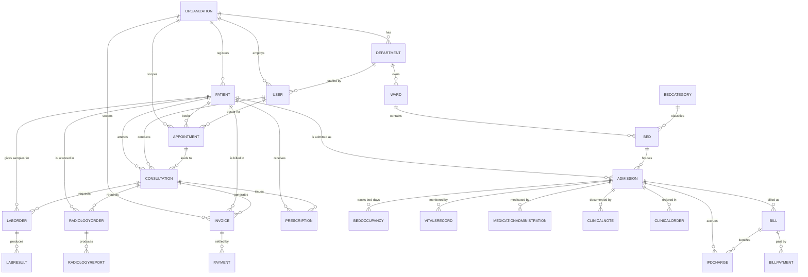

# Hospital Management System — Database Relations Report

**Prepared for:** Client Review
**Database:** PostgreSQL (via Prisma ORM)
**Total Tables:** 73
**Architecture:** Multi-tenant, patient-centric, fully relational with referential integrity

---

## 1. Executive Summary (in plain language)

The database is built around **three central "hub" tables** that everything else connects to:

| Hub Table | Role | Plain meaning |
|-----------|------|---------------|
| **Organization** | Tenancy root | Every single record belongs to one hospital/clinic. This lets one system safely serve many hospitals, with their data fully separated. |
| **Patient** | Clinical root | Almost every medical record (visits, tests, bills, admissions) links back to one patient — giving a complete 360° patient history. |
| **Admission** | Inpatient (IPD) root | When a patient is admitted, all bed charges, vitals, medicines, notes, and bills link to that one admission record. |

Every table is connected through **foreign keys** (enforced links), so the data can never become orphaned or inconsistent — this is what makes the reports, billing, and patient history reliable.

---

## 2. High-Level Relationship Map



> The full system has 73 tables; the diagram above shows the **core flow** a patient travels through. Detailed per-domain links are listed in Section 4.

---

## 3. The Patient Journey (how tables connect in real life)

This is the story your data tells, end to end:

```
1. Patient registers            → PATIENT (linked to ORGANIZATION)
2. Books a visit                → APPOINTMENT (Patient + Doctor/USER)
3. Front desk screening         → PRE_TRIAGE / QUEUE / TRIAGE_ASSESSMENT (→ Patient)
4. Sees the doctor              → CONSULTATION (Appointment + Patient + Doctor)
5. Doctor orders tests          → LAB_ORDER / RADIOLOGY_ORDER (→ Consultation)
       lab result               → LAB_RESULT (→ Lab Order + Lab Test)
       scan report              → RADIOLOGY_REPORT (→ Radiology Order)
6. Doctor prescribes medicine   → PRESCRIPTION → PHARMACY_SALE (→ Patient)
7. Billing                      → INVOICE → PAYMENT (→ Consultation + Patient)
8. If admitted (IPD)            → ADMISSION (Patient + BED in a WARD)
       daily bed charges        → BED_OCCUPANCY / IPD_CHARGE (→ Admission)
       vitals / medicines       → VITALS_RECORD / MEDICATION_ADMINISTRATION (→ Admission)
       doctor notes / orders    → CLINICAL_NOTE / CLINICAL_ORDER (→ Admission)
       final inpatient bill     → BILL → BILL_PAYMENT (→ Admission)
9. Discharge / outcome          → DISCHARGE_CLEARANCE / DEATH_CERTIFICATE (→ Admission/Patient)
```

Every arrow above is a **real foreign-key link** in the database — not just a concept.

---

## 4. Detailed Relations by Module

Each table below lists its parent links (`→ Parent` means "this table belongs to / points to that table").

### 4.1 Core & Tenancy
| Table | Links to (Foreign Keys) |
|-------|--------------------------|
| Organization | *(root — parent of all tables)* |
| User | → Organization, → Department |
| Department | → Organization |

### 4.2 Patient & Front Desk
| Table | Links to |
|-------|----------|
| Patient | → Organization |
| PatientDocument | → Organization, → Patient |
| PreTriage | → Organization, → Patient |
| QueueManagement | → Organization, → Patient |
| TriageAssessment | → Organization, → Patient |
| Appointment | → Organization, → Patient, → User (doctor) |
| Consultation | → Organization, → Patient, → Appointment, → User (doctor) |

### 4.3 Inpatient (IPD) — built around **Admission**
| Table | Links to |
|-------|----------|
| Ward | → Organization, → Department |
| BedCategory | → Organization |
| Bed | → Organization, → Ward, → BedCategory |
| Admission | → Organization, → Patient, → Bed |
| TariffPlan | → Organization |
| TariffRule | → Organization, → TariffPlan |
| ChargeMaster | → Organization |
| PatientTariff | → Organization, → Admission |
| BedOccupancy | → Organization, → Admission, → Bed, → BedCategory |
| IpdCharge | → Organization, → Admission, → ChargeMaster, → Bill |
| Bill | → Organization, → Admission |
| BillPayment | → Organization, → Bill, → Admission |
| BillCounter | → Organization |
| VitalsRecord | → Organization, → Admission |
| ClinicalNote | → Organization, → Admission |
| MedicationAdministration | → Organization, → Admission |
| DischargeClearance | → Organization, → Admission |
| HousekeepingTask | → Organization, → Bed |
| ClinicalOrder | → Organization, → Admission |
| OrderTask | → Organization, → Admission, → ClinicalOrder |
| ClinicalOrderEvent | → ClinicalOrder |
| IpdConsultation | → Organization, → Admission, → Department, → IpdCharge |
| DeathCertificate | → Organization, → Patient |

### 4.4 Pharmacy
| Table | Links to |
|-------|----------|
| PharmacyDrug | → Organization |
| PharmacyBatch | → PharmacyDrug, → Vendor |
| Prescription | → Organization, → Patient, → Consultation |
| PharmacySale | → Organization, → Patient, → Prescription |
| PharmacyPurchaseOrder | → Organization, → Vendor |
| StockLedger | → Organization, → PharmacyDrug |
| Vendor | → Organization |
| MedicineReference | *(standalone master list)* |

### 4.5 Laboratory
| Table | Links to |
|-------|----------|
| LabTest | → Organization |
| LabOrder | → Organization, → Patient, → Consultation |
| LabResult | → LabOrder, → LabTest |

### 4.6 Radiology
| Table | Links to |
|-------|----------|
| RadiologyExam | → Organization |
| RadiologyOrder | → Organization, → Patient, → Consultation, → RadiologyExam |
| RadiologyReport | → RadiologyOrder |

### 4.7 Billing (OPD) & Doctor Payouts
| Table | Links to |
|-------|----------|
| BillingService | → Organization |
| Invoice | → Organization, → Patient, → Consultation |
| Payment | → Organization, → Invoice, → Patient |
| DoctorFeeSlab | → Organization |
| DoctorCommissionConfig | → Organization |
| DoctorCommission | → Organization |

### 4.8 Ambulance, Day Care & Insurance
| Table | Links to |
|-------|----------|
| AmbulanceTrip | → Organization, → Patient |
| DayCareCase | → Organization, → Patient |
| InsuranceCase | → Organization, → Patient |
| InsuranceClaim | → Organization, → InsuranceCase |

### 4.9 Machine Integration (Lab/Radiology devices)
| Table | Links to |
|-------|----------|
| MachineIntegration | → Organization |
| MachineResultsQueue | → Organization, → MachineIntegration, → Patient |
| IntegrationLog | → MachineIntegration |

### 4.10 System, Security & Audit
| Table | Links to |
|-------|----------|
| UserInvitation | → Organization, → User |
| Permission | *(master list)* |
| RolePermission | → Permission |
| UserActivity | → User |
| AuditLog | → Organization, → User |
| Notification | → Organization, → User |

### 4.11 eAPTS Drug Reporting Integration
| Table | Links to |
|-------|----------|
| EaptsConfig | → Organization |
| EaptsMedicationMapping | → Organization, → PharmacyDrug |
| EaptsTransaction | → Organization |

---

## 5. Why This Design Is Strong (talking points for the client)

1. **Multi-tenant by design** — every table carries an `organizationId`. One deployment can host many hospitals with fully isolated data.
2. **Patient-centric** — all clinical activity links back to a single patient record, giving a complete, auditable history.
3. **Referential integrity** — foreign keys prevent orphan or broken records (e.g., you can't have a bill with no patient).
4. **Indexed for scale** — the schema defines **276 indexes/keys**, so searches and reports stay fast even with millions of records.
5. **Separation of concerns** — OPD billing (Invoice/Payment) is kept distinct from IPD billing (Bill/BillPayment), matching how real hospitals account for outpatient vs inpatient money.
6. **Full audit trail** — `AuditLog`, `UserActivity`, and `Notification` track who did what, when — important for medical compliance.

---

## 6. How to Read the Relationships

- **One-to-Many (most common):** One parent has many children.
  *Example:* one **Patient** has many **Appointments**; one **Admission** has many **VitalsRecords**.
- **A child always points "up" to its parent** via a foreign key (the `→` arrows above).
- **The Organization table sits above everything** — it is the top parent of the entire system.

---

*This report was generated directly from the live database schema (`backend/prisma/schema.prisma`). The Mermaid diagram in Section 2 can be viewed in any Markdown viewer that supports diagrams (GitHub, VS Code with a Mermaid extension, or mermaid.live).*
