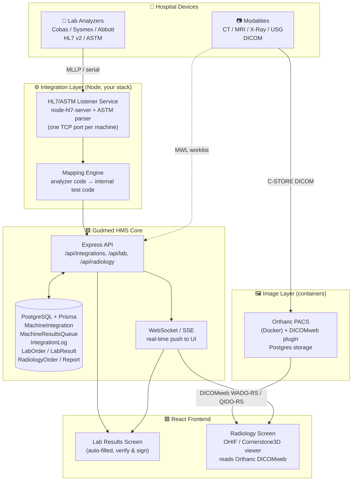
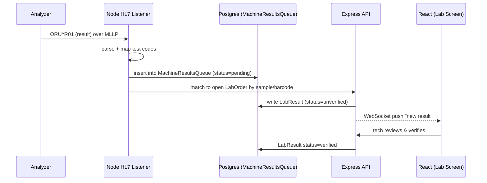
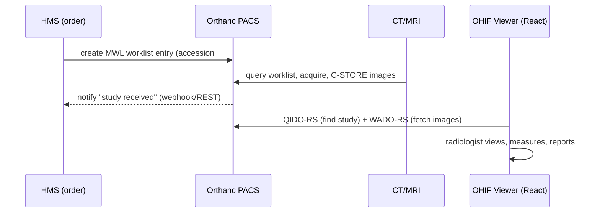

# Lab & Radiology Integration — Open-Source Reuse Strategy for Gudmed HMS

**Stack:** Node.js · Express · React · PostgreSQL · Prisma · Multi-tenant
**Goal:** Reuse production-grade open source to cut Lab/Radiology integration effort by 50%+
**Date:** June 2026

> **You already have a head start.** Your schema defines `MachineIntegration`, `MachineResultsQueue`,
> and `IntegrationLog` tables with enums for `hl7 / astm / rest_api / file_upload / serial` and
> machine types `lab_analyzer / radiology_equipment / vital_signs_monitor`. The middleware **data layer
> is already designed** — we only need to plug in the listeners/parsers and an image server.

---

## TL;DR — The Recommendation

| Need | Recommended approach | Why |
|------|---------------------|-----|
| **Radiology PACS + images** | **Orthanc** (run as Docker container) | Lightweight, REST + DICOMweb, perfect for small/mid hospitals. Biggest time-saver here. |
| **Radiology viewing in React** | **OHIF Viewer** + **Cornerstone3D** | MIT, React-native, reads from Orthanc via DICOMweb. Zero viewer code to write. |
| **Lab analyzer results (HL7/ASTM)** | **Thin Node middleware** using `node-hl7-server` + ASTM parser → write into your existing `MachineResultsQueue` | Keeps everything in your stack; full HL7 LIS engines are overkill. |
| **Heavy multi-system HL7 routing** | **Open Integration Engine (OIE)** as side middleware *(only if/when needed)* | The open fork of Mirth; use it when you integrate many external hospital systems. |
| **Analyzer mapping reference** | Study **OpenELIS Global** mappings (don't adopt the whole app) | It has ready ASTM/HL7 mappings for Cobas, Sysmex, GeneXpert. |

**Effort saved:** Radiology ~70% (Orthanc+OHIF replace a PACS + viewer build). Lab ~50% (libraries + reference mappings replace protocol-from-scratch work).

---

## PART 1 — How Enterprise Hospitals Actually Do This (the real workflow)

### Lab (analyzer → LIS)
```
Analyzer (Roche Cobas, Sysmex, Abbott, etc.)
   │  speaks ASTM LIS2-A2 (older) or HL7 v2.x (ORU^R01) over TCP/IP (MLLP) or serial
   ▼
Middleware / interface engine  ── listens on a TCP port per machine
   │  parses the message, maps analyzer test codes → your internal test codes
   ▼
LIS / HMS  ── result auto-populates against the right LabOrder; tech only verifies
```
- Two directions: **Host Query** (LIS tells machine which tests to run for a sample barcode) and **Result Upload** (machine sends results back). Start with result upload (one-way); add bi-directional later.
- Each analyzer model has quirks → this is why a **mapping layer** per machine is essential.

### Radiology (modality → PACS → viewer + RIS)
```
Modality (CT / MRI / X-Ray / Ultrasound)
   │  pushes DICOM images via C-STORE; gets worklist via DICOM MWL (HL7 order in)
   ▼
PACS (stores images)  ── Orthanc / dcm4chee
   │  exposes images over DICOMweb (WADO-RS / QIDO-RS)
   ▼
Web viewer (OHIF) in your React app   +   RIS workflow (order → schedule → report) in your HMS
   │  radiologist reads, dictates report → report (HL7 ORU / PDF) back to HMS
```
- **RIS = the workflow/reporting** (you mostly have this in your radiology module).
- **PACS = the image store** (use Orthanc — don't build).
- **Viewer = display** (use OHIF/Cornerstone — don't build).

---

## PART 2 — Repository Research (verified, mid-2026)

### A. Radiology — PACS servers

| Project | URL | License | Stack | Stars/Activity | Production-ready? | Verdict |
|---|---|---|---|---|---|---|
| **Orthanc** ⭐ | github.com/jodogne/Orthanc (orthanc-server.com) | **GPLv3** (framework LGPLv3) | C++ | Very active, ~6,500 commits | ✅ Yes (small/mid hospitals, research) | **USE AS-IS (container)** |
| **dcm4chee-arc-light** | github.com/dcm4che/dcm4chee-arc-light | MPL/GPL/LGPL | Java | Active, large | ✅ Yes (enterprise scale) | Use if you outgrow Orthanc |

**Orthanc pros:** tiny footprint, built-in REST + **DICOMweb** plugin, Postgres storage plugin, plugin ecosystem (OHIF, DICOMweb, WSI), great docs. **Cons:** not a full enterprise PACS (no heavy IHE/HL7 stack — fine for you). **Integration complexity: LOW** (run container, push DICOM, read via DICOMweb).

> **GPL note (important & in your favor):** You run Orthanc as a **separate process/container** and talk to it over HTTP/DICOMweb. You are **not linking its code into your Node app**, so GPLv3 does **not** "infect" your HMS source. This is the standard, legal deployment pattern.

### B. Radiology — Web Viewer (for your React frontend)

| Project | URL | License | Stack | Activity | Verdict |
|---|---|---|---|---|---|
| **OHIF Viewer** ⭐ | github.com/OHIF/Viewers | **MIT** | React, TypeScript | Very active (v3.11, 2026) | **USE AS-IS / Fork** |
| **Cornerstone3D** | github.com/cornerstonejs/cornerstone3D | **MIT** | TypeScript, Vite/React-ready | Very active (v2+) | **Use as library** (powers OHIF) |

- **OHIF** = full viewer app; embed it or run alongside and deep-link to a study. Reads directly from Orthanc's DICOMweb.
- **Cornerstone3D** = the rendering engine if you want a viewer **inside** your own React components (MPR, measurements, annotations). Integrates with **Vite + React** (your exact stack).
- **Integration complexity: LOW–MEDIUM.** MIT = no license worries, fully commercial-safe.

### C. Laboratory — Node.js HL7/ASTM libraries (recommended building blocks)

| Library | npm | License | Stack | Notes |
|---|---|---|---|---|
| **node-hl7-server** / **node-hl7-client** ⭐ | `node-hl7-server`, `node-hl7-client` | MIT | **TypeScript**, dependency-free | MLLP server + client; parse/build HL7 v2. Best fit for your stack. |
| **hl7v2** (panates) | `hl7v2` | MIT | TypeScript | Parser, serializer, **server + client** classes. Strong alternative. |
| **simple-hl7** | `simple-hl7` | MIT | JS | Mature, simple parse/build; older but stable. |
| **hl7-mllp** | `hl7-mllp` | MIT | JS | Just the MLLP transport if you want to assemble your own. |

For **ASTM** (older analyzers): fewer Node libs exist; ASTM LIS2-A2 framing is simple (STX/ETX, checksums) — implement a small parser (a few hundred lines) or use a Python sidecar. Reference: OpenELIS's analyzer plugins.

### D. Laboratory — Full LIS platforms (reference, not adoption)

| Project | URL | License | Stack | Verdict |
|---|---|---|---|---|
| **OpenELIS Global** | github.com/I-TECH-UW/OpenELIS-Global-2 | Mozilla (MPL-style) | **Java + PostgreSQL** | **Reference for mappings.** Native ASTM LIS2-A2 + HL7; ready mappings for Cobas/Sysmex/GeneXpert. |
| **SENAITE** | github.com/senaite/senaite.core | GPLv2 | Python/Plone (ZODB) | Avoid for adoption (wrong stack, GPL, heavy). Good ideas only. |
| **Bahmni** | (OpenMRS ecosystem) | Various | Java/OpenMRS | Whole EMR suite — too big to adopt; study its SENAITE/PACS integration pattern. |

> **Why not adopt a full LIS?** You already have a lab module in your HMS. Bolting on OpenELIS (separate Java app + its own Postgres + its own UI) means running and syncing a second system. The 50%+ saving comes from **reusing its analyzer protocol knowledge/mappings**, not its application.

### E. Integration Engines

| Engine | License | Stack | Status | Verdict for Gudmed |
|---|---|---|---|---|
| **Mirth Connect** (NextGen) | ❌ **Closed-source since v4.6 (Mar 2025)** | Java | Last OSS = 4.5.2 | **Avoid new dependence** — license risk for a product you sell. |
| **Open Integration Engine (OIE)** ⭐ | **MPL 2.0** | Java | Fork of Mirth; v4.5.2 (Jul 2025), 192★, active | **USE AS MIDDLEWARE** when you need heavy HL7 routing. Channel-compatible with Mirth. |
| **BridgeLink** | MPL 2.0 | Java | Another Mirth fork | Alternative to OIE. |
| **Apache Camel** (+ HL7/DICOM components) | Apache-2.0 | Java | Very active | Powerful but code-heavy; overkill unless you want a JVM ESB. |
| **HAPI HL7v2** (library) | Apache-2.0 | Java | Active | Great if you go JVM; you're Node, so prefer node-hl7. |

**Recommendation:** For Gudmed's current scale, **don't add a Java integration engine yet.** Build a thin Node HL7/ASTM middleware (your stack, your DB, your `MachineResultsQueue`). Adopt **OIE** only when you start onboarding many external hospital/lab systems that demand standardized HL7/FHIR routing.

---

## PART 3 — Recommended Architecture (tailored to your stack + existing tables)



### Lab result flow (real-time)


### Radiology image flow


---

## PART 4 — Development Strategy (classification)

| Solution | Classification | Action |
|---|---|---|
| **Orthanc** | **Use as Middleware (container)** | Deploy via Docker; talk DICOMweb. Don't modify its code. |
| **OHIF Viewer** | **Use As-Is / Fork** | Embed or deep-link; fork only to theme it. |
| **Cornerstone3D** | **Use As-Is (library)** | npm install into your React app for an in-app viewer. |
| **node-hl7-server / client** | **Use As-Is (library)** | Core of your lab listener service. |
| **OpenELIS** | **Reference only** | Copy its analyzer mapping knowledge; don't run the app. |
| **Open Integration Engine** | **Use as Middleware (future)** | Add when multi-hospital HL7 routing is needed. |
| **Mirth Connect 4.6+** | **AVOID** | Closed-source now; license risk for a commercial HMS. |
| **SENAITE / Bahmni** | **Avoid (adoption)** | Wrong stack / too heavy; study patterns only. |
| **dcm4chee** | **Defer** | Adopt only if you reach true enterprise imaging scale. |

---

## PART 5 — Recommended Tech Stack (additions to what you have)

| Layer | Add | Notes |
|---|---|---|
| PACS | **Orthanc** + `orthanc-dicomweb` + `orthanc-postgresql` plugins | Docker container |
| Radiology viewer | **@ohif/viewer** or **@cornerstonejs/core** + `@cornerstonejs/dicom-image-loader` | MIT |
| Lab listener | **node-hl7-server**, **node-hl7-client** (+ small ASTM parser) | runs as a separate Node service/worker |
| Realtime | **socket.io** or native SSE | push results to React instantly |
| Your DB | *(no change)* `MachineResultsQueue` already models the inbox | — |

---

## PART 6 — Implementation Roadmap

**Phase 0 — Foundations (1 week)**
- Stand up **Orthanc** via Docker with DICOMweb + PostgreSQL plugins. Push a sample DICOM, view it via the built-in Orthanc Explorer. Confirms PACS works.

**Phase 1 — Radiology viewing (1–2 weeks)** *(fastest visible win)*
- Embed **OHIF** (or Cornerstone3D) in your React radiology module, pointed at Orthanc's DICOMweb.
- Link `RadiologyOrder` → study via **accession number**. Radiologist can open images from the order. **No PACS or viewer code written.**

**Phase 2 — Radiology worklist + report back (1–2 weeks)**
- Push DICOM **MWL** worklist from HMS so modalities pull the right patient/accession.
- Orthanc webhook → mark `RadiologyOrder` "images received". Report (PDF/HL7) saved to `RadiologyReport`.

**Phase 3 — Lab listener, one analyzer (2–3 weeks)**
- Build the **Node HL7 listener service** (`node-hl7-server`) for ONE analyzer (pick your most-used, e.g. a Sysmex or Cobas with HL7).
- Parse `ORU^R01` → map codes → insert into `MachineResultsQueue` → match `LabOrder` → write `LabResult` (unverified) → WebSocket to UI.
- Use `IntegrationLog` for every message (you already have the table).

**Phase 4 — More analyzers + ASTM (ongoing)**
- Add a **mapping config per machine** (store in `MachineIntegration`). Add a small **ASTM parser** for older analyzers. Reference OpenELIS mappings.

**Phase 5 — Bi-directional + scale (later)**
- Host Query (LIS → analyzer by barcode). If external-hospital HL7 routing grows, introduce **OIE** as the edge engine.

---

## Bottom Line
- **Radiology: don't build.** Orthanc (PACS) + OHIF/Cornerstone (viewer) = ~70% saved, MIT viewer, container PACS, your React stack.
- **Lab: build thin, reuse smart.** Node HL7 libraries + OpenELIS mapping knowledge + your existing `MachineResultsQueue` = ~50% saved, all in your stack.
- **Engines: avoid Mirth (now closed); keep OIE in your back pocket** for future multi-system HL7.
- Your pre-built `MachineIntegration / MachineResultsQueue / IntegrationLog` tables mean the hardest design decision is already done — this is mostly wiring, not architecture.
```
